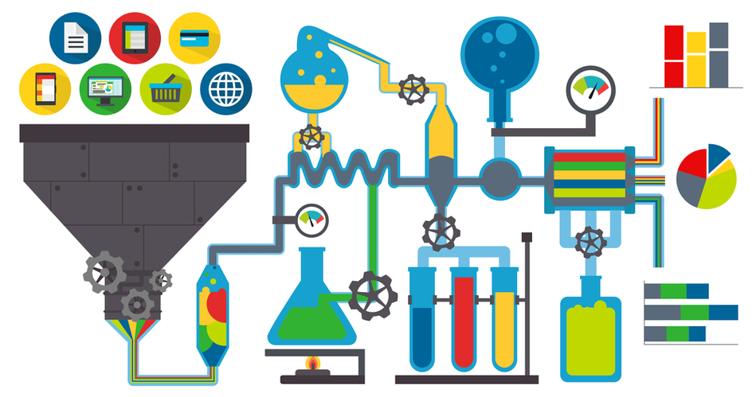
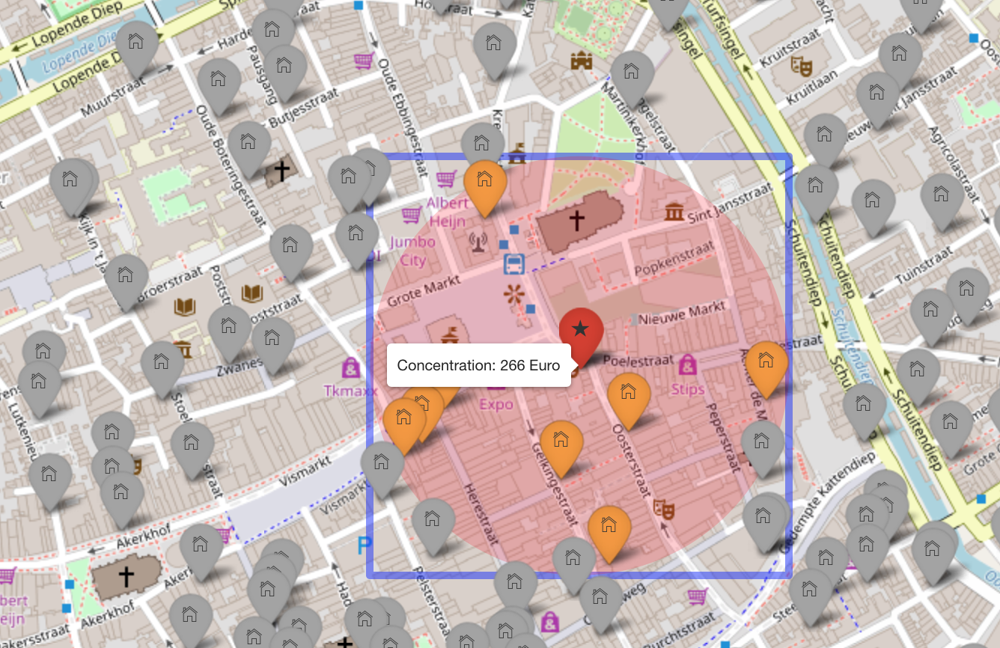
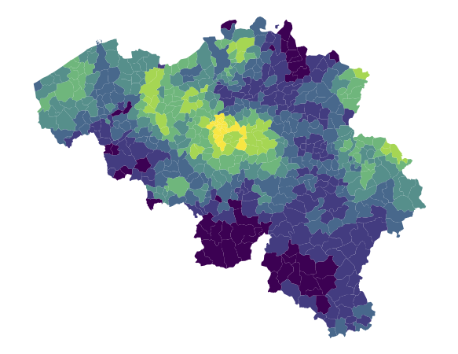

```{js}
$("#rStudioHeader").removeClass("alwaysShrunk");
$("#pageContent").removeClass("standardPadding");
```


<!--html_preserve-->

<div id="homeContent">
  <div class="band full blue first rightText">
    <div class="bandContent vCenter">
      <div class="blurb">
        <div class="tagline">Welcome!</div>
        <div>This portfolio describes two data-related projects I worked on. The first project is a project I did at the risk department of a large Dutch insurance company. The second project was part of my Master's thesis.</div>
      </div>
    </div>
    
  </div>
  <div class="band full gray1 second leftText">
    <div class="bandContent vCenter">
      <div class="blurb">
        <div>Determine the coördinates (long/lat) with the highest concentration risks. Concentration risk is defined as the cumulation of all exposures within a certain radius. </div>
      </div>
       <div class="actions">
          <div><a href="concentration.html"><button class="bigButton getStarted">Project 1: Concentration risk</button></a></div>
        </div>
    </div>
    
  </div>

  <div class="band full third rightText">
    
    <div class="bandContent vCenter">
      <div class="blurb">
        <div>In my Master's thesis I used Laplace approximations to predict the number of claims in a motor insurance portfolio on a small-area level. The thesis was nominated for the Johan de Witt award for best actuarial thesis in 2016. </div>
        <div class="actions">
          <div><a href="thesis.html"><button class="bigButton gallery">Project 2: Master's thesis</button></a></div>
        </div>
      </div>
    </div>
  </div>
</div>

<!--/html_preserve-->


