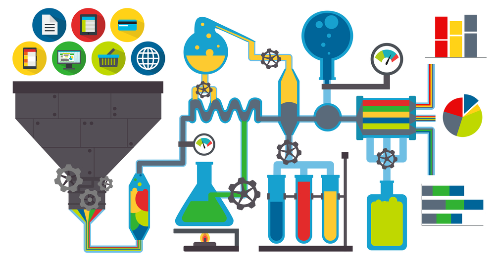

I am an insurance risk trainee at Delta Lloyd. I have a passion for data visualization and sharing my knowledge on Quora, where I write answers to help people interested in Data Science, Probability, Statistics, and more.

Previously, I studied Econometrics at the University of Groningen, where I received my Bachelor's Degree. At the University of Amsterdam I received my Master's degree in Actuarial Science and Mathematical Finance.

This portfolio describes two projects I worked on. The first project is a project I did for the risk department of a large Dutch insurance company. The second project below was part of my Master's thesis.

